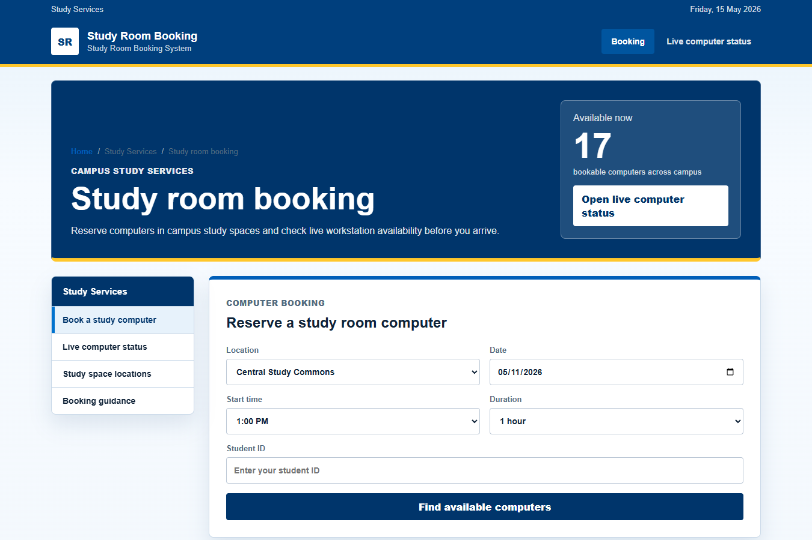
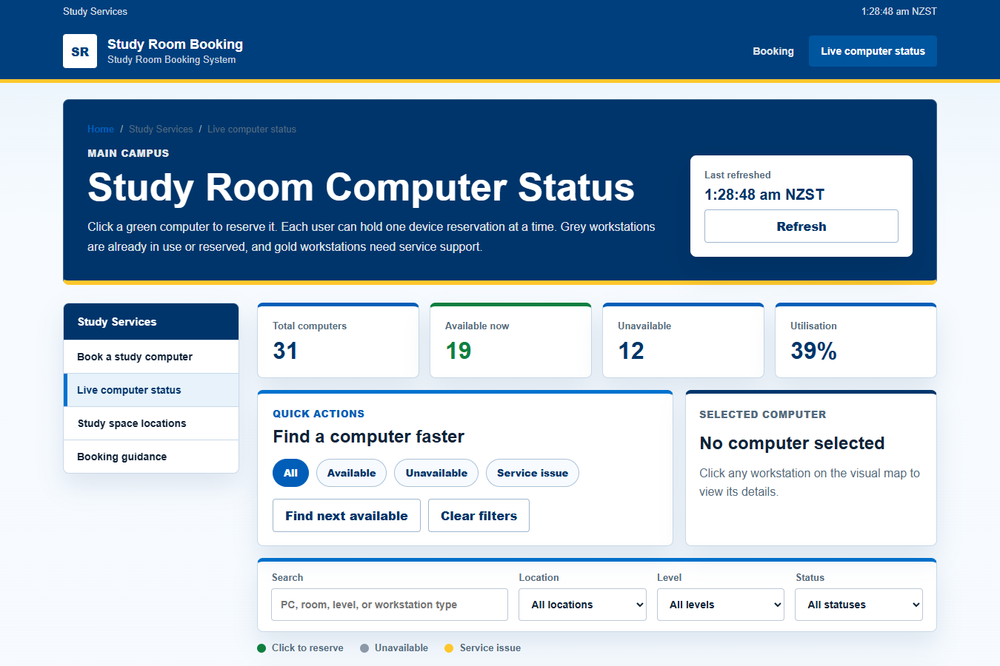
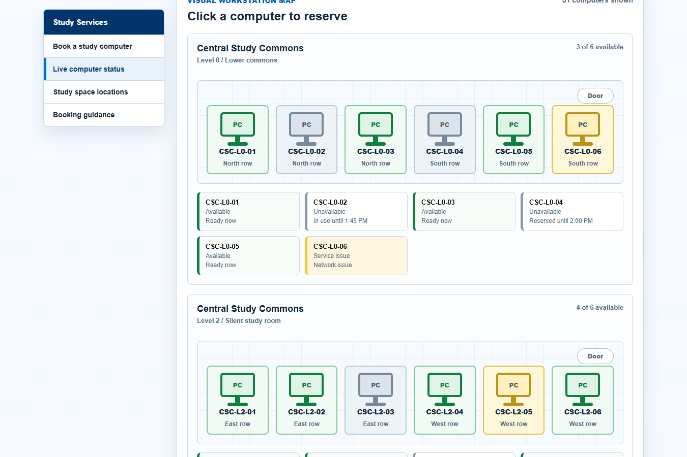

# Study Room Booking System

A Vue 3 study computer booking demo for checking live workstation availability and reserving one device from a visual room map.



## What It Does

This project presents a campus-style booking interface where students can check which study computers are available before they arrive. The system includes a booking entry page, a live status dashboard, and an interactive computer map that lets users reserve an available workstation.

## Preview

The opening screenshot shows the booking workspace with a clear form, current availability summary, and a direct path into the live computer status page.

### Live Status Dashboard

The status page summarizes total workstations, available computers, unavailable devices, service issues, and the user's current reservation.



### Clickable Computer Map

Each workstation is displayed as an individual computer. Green computers are available and can be reserved, grey computers are unavailable, and amber computers show a service issue.



## Core Features

- Visual workstation map with individual computer states.
- Click-to-reserve flow for available computers.
- One active reservation per user.
- Reservation panel with cancel option.
- Device detail panel for selected computers.
- Quick filters for all, available, unavailable, and service issue devices.
- Session activity log for recent actions.
- Responsive blue campus-style interface.

## User Flow

1. Open the booking page and review the study space availability summary.
2. Open the live computer status page.
3. Select a green available computer from the visual map.
4. Confirm the reservation.
5. Cancel the current reservation before booking a different computer.

## Tech Stack

- Vue 3
- Vite
- HTML
- CSS
- JavaScript

## Run Locally

```bash
npm install
npm run dev
```

Then open the local URL printed by Vite.

## Project Structure

```text
.
|-- docs/
|   |-- preview-home.png
|   |-- preview-status-overview.png
|   `-- preview-computer-map.png
|-- src/
|   |-- StatusApp.vue
|   |-- main.js
|   |-- status.js
|   `-- styles.css
|-- index.html
|-- status.html
|-- package.json
`-- vite.config.js
```

## Note

This is a generic demo project for study computer booking workflows. It is not an official campus service.
